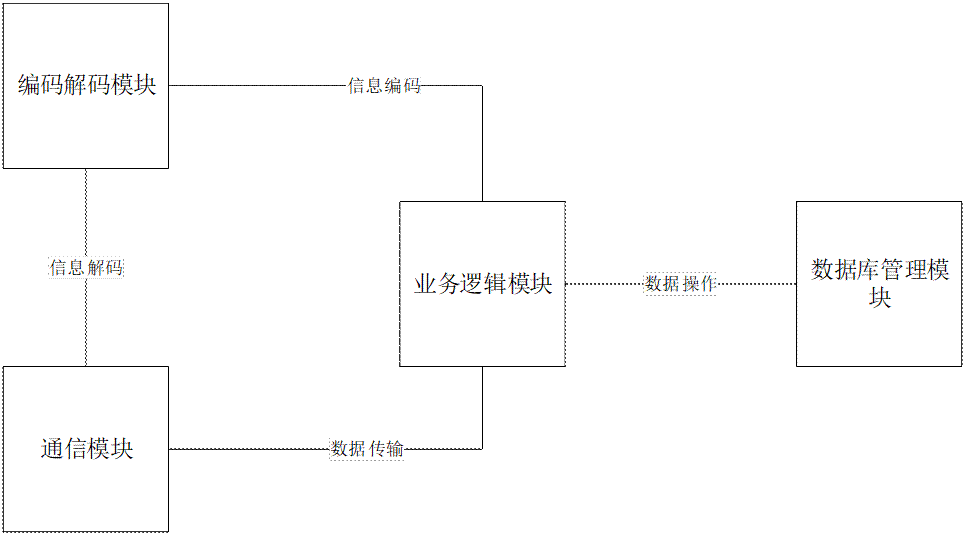
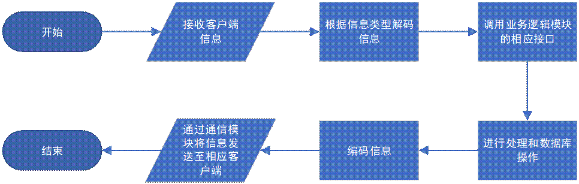
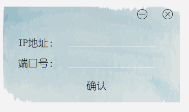
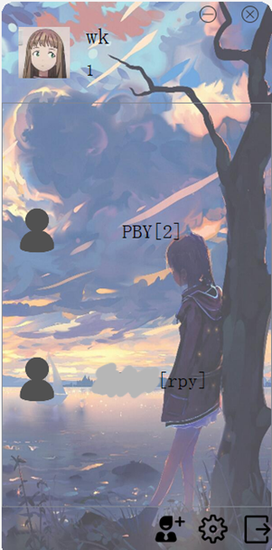
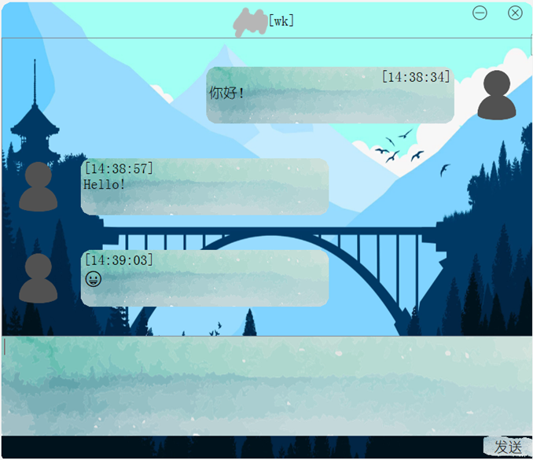
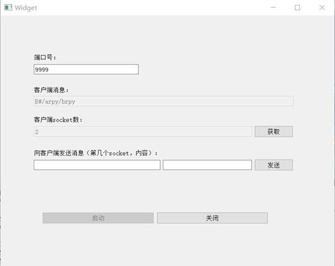

# Le-Vent-Chat

       

> 一个基于 Qt 5.12 的即时通讯软件前后端。
>
> An instant messaging (IM) software based on Qt 5.12, including the front-end and back-end.

## repo 架构

- [LeVentClient/](LeVentClient/)：客户端（前端）的源码，是一个 `Qt 5` 项目
- [LeVentServer/](LeVentServer/)：服务器端（后端）的源码，是一个 `Qt 5` 项目

## 引言

### 项目概述

本项目的主要目标是开发一款运行于Windows操作系统平台的IM（即时通信）软件，实现局域网内任意电脑之间的信息接收与发送，也可作为支持200人中小规模企业其信息平台中的一个组件或功能存在。

### 需求分析

企业信息平台通常具有内部通信的需求，本次项目开发的系统可以实现局域网内不同客户端之间的相互通信，其可以作为企业信息平台中内部通信功能的实现部分。

### 运行环境

本项目服务器和客户端软件均在Windows系统平台下运行，并要求运行环境可以连接到同一个局域网。

## 项目设计

### 设计思路

系统分为服务器和客户端两个部分。同一个服务器与多个客户端进行连接，不同的客户端之间通过服务器进行通讯。同时客户端提供登录、注册、好友、设置、注销等功能。

### 模块功能介绍

#### 服务器端

服务器端主要分为通信模块、编码解码模块、业务逻辑模块和数据库管理模块四大部分。

通信模块负责与客户端之间的信息通讯。其可以接收客户端发来的消息，传输给其他模块处理；也能够接收服务器其他模块的消息，将其发送到对应的客户端。

编码解码模块负责按照预先设定好的通信格式对服务器与客户端之间的通讯信息进行解析或编码。其可以将客户端发来的信息解析成特定的数据结构，以供服务器业务逻辑模块使用；也可以将服务器想要发送的信息从特定的数据结构编码成对应字符串，由通信模块发送至对应客户端。

业务逻辑模块是整个服务器端软件的核心，协调统领各模块之间的工作，负责登录、注册、添加好友、修改密码、发送信息等功能的服务器端实现。

数据库管理模块负责维护服务器端数据库，并向服务器端其他模块提供数据的插入、删除、修改、查询功能。

#### 客户端

…

### 模块结构图

#### 服务器端

#### 客户端

…

### 程序流程图

#### 服务器端

#### 客户端

…

## 详细设计

通信模块基于TCP（传输控制协议）实现。TCP是一种可靠的、面向流的、面向连接的传输协议，适合于数据的连续传输。软件通过实例化QTcpSocket的包装类实现TCP连接的建立和数据流的传输。所有的套接字都与唯一一个QTcpServer的包装类实例化对象连接。QTcpServer类提供基于TCP的服务器，可以监听特定地址或机器的所有地址，接收传入的TCP连接。

编码解码模块是本项目中自定义程度比较高的一个模块。在本次项目中，我们根据不同的消息类型规定了一套字符串编码格式。根据该格式，本模块可以将输入的字符串解析成对应的数据结构，也可以将输入的数据结构编码成字符串。

服务器业务逻辑模块中，我们通过TcpServer对象提供服务器功能，使用QList存储连接至服务器的套接字指针，使用QMap存储在线用户信息以及缓存的待发送信息。当用户注册时，本模块会判断其用户名是否已注册，并拒绝重复注册的请求；当用户登录时，本模块会判断该用户是否存在、用户的密码是否正确，并在登录成功后投递该用户在离线阶段未收到的信息；当用户发出添加好友请求时，本模块会判断目标用户是否存在、是否已是其好友，以此判断是否接受该请求；当用户发出密码修改请求时，本模块会判断原密码是否正确，以此判断是否接受该请求；当用户发出发送消息请求时，本模块会判断目标是否在线，若在线则进行投递，离线则缓存在服务器中，待其下一次登录时一并投递；当用户发出下线请求时，本模块会将其对应的套接字清除出在线列表，并将其置为“离线”状态。

数据库管理模块基于SQLite数据库管理系统。共建有用户信息表和好友关系表两个数据表。用户信息表存储每一个已注册的用户的用户名、昵称和密码；好友关系表存储每一对建立好友关系的用户的用户名。本模块提供查询用户是否存在、插入用户信息、查询用户密码、查询用户信息、查询用户好友信息、修改用户密码、插入好友关系、删除好友关系功能。

## 效果演示

### 登录界面

### 选择端口界面

### 注册界面

### 好友界面

### 修改密码界面

### 聊天界面

### 服务器端

